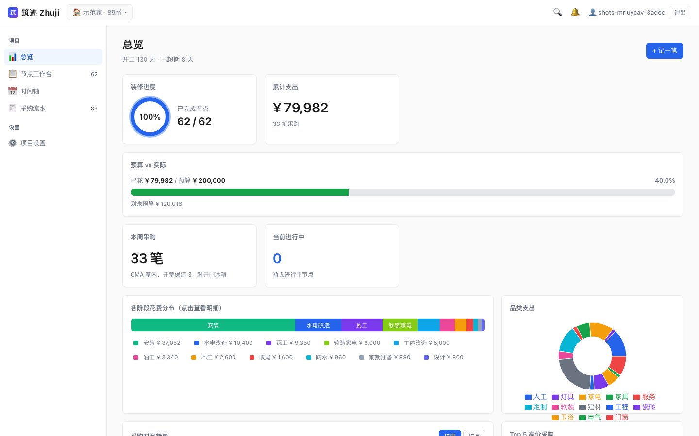
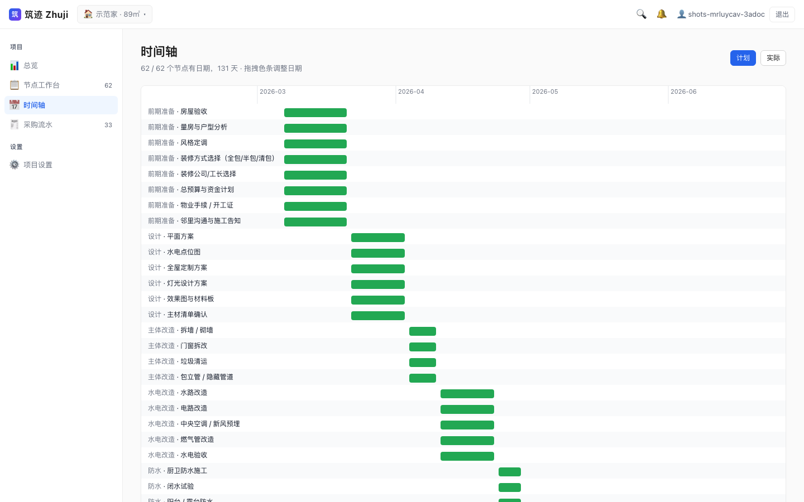
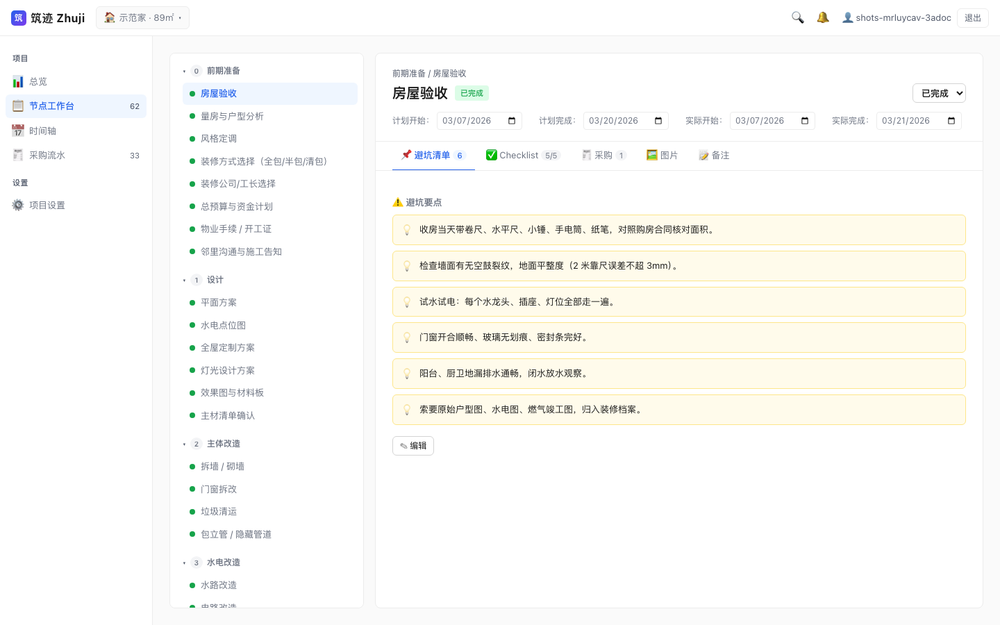
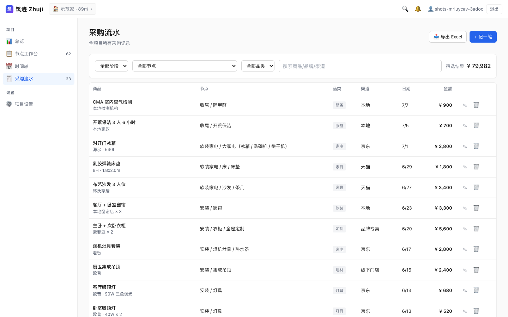

# Zhuji 筑迹 — Home Renovation Manager / 装修管家 Web App

[](https://github.com/tomqiaozc/zhuji/actions/workflows/ci.yml)
[](#license--许可)


> A full-lifecycle renovation manager for a single homeowner. Since M5/M6 it runs a **cloud-authoritative + local-cache** full-stack architecture: username/password login, with milestones / purchases / reminders stored in PostgreSQL and image assets in Azure Blob, shared across devices; the frontend Dexie/IndexedDB acts only as a read cache to keep `useLiveQuery` reactive.

> 单人业主的装修全流程管家。M5/M6 起为**云端为权威 + 本地缓存**的全栈架构：用户名/密码登录，节点 / 采购 / 提醒数据存 PostgreSQL，图片资产存 Azure Blob，多设备共享同一份记录；前端 Dexie/IndexedDB 仅作读缓存以保留 `useLiveQuery` 的响应性。

## Screenshots / 界面截图

| Dashboard / 总览 | Timeline Gantt / 时间轴甘特图 |
| :---: | :---: |
| [](docs/screenshots/dashboard.png) | [](docs/screenshots/gantt.png) |
| **Budget / progress / spend at a glance, with per-stage & per-category charts**<br>预算 / 进度 / 花费一屏总览，阶段与品类花费可视化 | **Planned vs. actual dual-track Gantt, drag bars to adjust dates**<br>计划 / 实际双轨甘特，色条可拖拽调整日期 |

| Node Workspace / 节点工作台 | Purchases / 采购流水 |
| :---: | :---: |
| [](docs/screenshots/nodes.png) | [](docs/screenshots/purchases.png) |
| **Each node carries pitfalls / checklist / purchases / images / notes**<br>每个节点带避坑清单 / Checklist / 采购 / 图片 / 备注 | **Full purchase ledger, filter by stage / node / category, export to Excel**<br>全项目采购明细，按阶段 / 节点 / 品类筛选，导出 Excel |

> Screenshots are from the built-in demo project (one-click "Load demo project" on the welcome screen).
> 截图取自内置示例项目（欢迎页「加载示例项目」一键载入）。

## Tech Stack / 技术栈

- **Frontend / 前端**: React 18 + Vite 6 + TypeScript + Zustand (UI state) + Dexie/IndexedDB (**read-only cache / 只读缓存**)
- **Backend / 后端**: FastAPI + SQLAlchemy[asyncio] + Alembic + PostgreSQL
- **Asset storage / 资产存储**: Azure Blob Storage (images), served via an authenticated backend proxy `/api/assets/:id/content`
- **Auth / 认证**: username + password (bcrypt) → JWT Bearer
- **Visualization / 可视化**: Recharts + custom SVG Gantt / 自研 SVG Gantt
- **Search / 搜索**: MiniSearch (Chinese char + word hybrid tokenization / 中文按字 + 词混合分词)
- **PWA**: vite-plugin-pwa (autoUpdate)
- **Testing / 测试**: pytest (backend / 后端) + Playwright (frontend M5 golden path / 前端 M5 黄金路径)

## Architecture / 架构概览

```
┌──────────────────────────────┐         ┌──────────────────────────────┐
│   Browser                    │         │   Azure App Service          │
│   ┌─────────────────────┐    │  HTTPS  │   ┌─────────────────────┐    │
│   │  React + Vite       │◄───┼─────────┼──►│  FastAPI            │    │
│   │  Zustand (UI state) │    │ JWT     │   │  SQLAlchemy/asyncio │    │
│   │  Dexie (read cache) │    │         │   │  Alembic            │    │
│   └─────────────────────┘    │         │   └────┬────────┬───────┘    │
│   PWA / Service Worker       │         │        │        │            │
└──────────────────────────────┘         │        ▼        ▼            │
                                         │   ┌────────┐ ┌──────────┐    │
                                         │   │Postgres│ │Blob Store│    │
                                         │   │ (data) │ │ (images) │    │
                                         │   └────────┘ └──────────┘    │
                                         └──────────────────────────────┘
```

写路径："写后端 → 写 Dexie 缓存"双写，UI 通过 `useLiveQuery` 立刻看到结果；
读路径：登录 / 启动时从 `GET /api/projects/:id/snapshot` 拉一次完整快照填充 Dexie，
之后 UI 全部从 Dexie 读，无需再访问后端。退出登录会清空本设备的 Dexie 缓存，云端数据不动。

## Local Development / 本地开发

需要本地能跑后端：用 docker-compose 起 Postgres + backend 最省事。

```bash
# 1. 启动后端（Postgres + FastAPI）
export JWT_SECRET=$(openssl rand -hex 32)
docker compose up --build
# 后端 http://localhost:8000  /  OpenAPI http://localhost:8000/docs

# 2. 启动前端（http://localhost:5173）
npm install
npm run dev
# Vite 已配置代理把 /api 转发到 http://localhost:8000
# 若后端在别处，设置 VITE_API_PROXY_TARGET 环境变量
```

> 图片上传走 Azure Blob，本地开发环境如果没配 `AZURE_STORAGE_*` 环境变量，
> 资产列表会返回 503，前端会显示"对象存储未配置：本地开发环境不支持图片上传，
> 部署到 Azure 后自动可用"。其他功能（节点 / 采购 / 提醒 / 时间线 / PDF）不受影响。

### Running Tests / 运行测试

```bash
# 后端单元 / 集成测试（用内存 SQLite，无需 Postgres）
cd backend
python3 -m venv .venv && source .venv/bin/activate
pip install -e ".[dev]"
pytest -v

# 前端 e2e（需要后端在跑）
#
# 重要：从干净 SQLite 启动时，必须先跑 alembic upgrade head 建表。
# docker compose 走 entrypoint.sh 时是自动跑的，但直接 uvicorn 不是。
cd backend && source .venv/bin/activate
export JWT_SECRET=test-only-32-chars-or-more-aaaaaaaa
export DATABASE_URL="sqlite+aiosqlite:///./e2e.db"
rm -f e2e.db                       # 起干净库
alembic upgrade head               # ← 必须，否则 /api/auth/register 会 500
python -m uvicorn src.main:app --host 127.0.0.1 --port 8000 &
cd .. && VITE_API_PROXY_TARGET=http://127.0.0.1:8000 npx playwright test
```

要求：Node 18+ / Python 3.9+。Playwright 首次运行会自动安装 Chromium。

## Data Persistence & Isolation / 数据持久化与隔离

数据全部存在云端 Postgres，每张业务表都有 `user_id` 外键，跨用户访问统一返回 404，
不会泄漏资源存在性。图片走 Azure Blob，容器私有，前端只能通过后端鉴权后的
`/api/assets/:id/content` 代理读取（不直链 SAS）。

前端 Dexie/IndexedDB 是**只读缓存**：写操作总是先调后端再镜像到 Dexie；
登出 / 401 / "从云端重新同步" 都会清掉本设备的 Dexie 行。

> M3 阶段的本地 Zip 备份 / 镜像目录功能在 M5 中已移除——数据由服务端
> 负责备份。PDF 装修档案导出（"设置 → 生成 PDF"）保留。

## Deployment / 部署

`docker compose up --build` 跑本地。生产部署到 Azure（M6）使用
Bicep + GitHub Actions，复用业主现有 `rg-rewind-ea` 资源组下的
App Service Plan / PostgreSQL / Key Vault / Storage / App Insights。

- 基础设施：`infra/main.bicep` + `infra/modules/appservice.bicep`
- CI / CD：`.github/workflows/{ci,deploy}.yml`
- 完整操作清单（业主一次性 az login / SP / KV secrets / 数据库创建）：
  **[infra/README.md](infra/README.md)**

新增云端成本 < ¥5/月（仅 Storage 流量；App Service / Postgres 复用现有 Plan）。

## Changelog / 变更日志

See [CHANGELOG.md](CHANGELOG.md). / 详见 [CHANGELOG.md](CHANGELOG.md)。

## License / 许可

MIT
